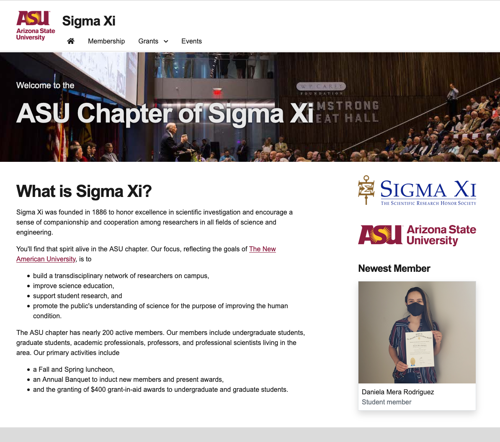
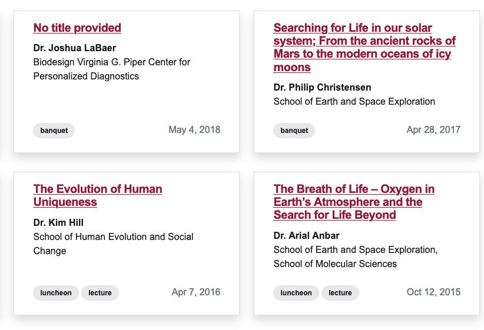

# ASU WS2.0 theme for HuGo
[Hugo](https://gohugo.io/) is a static website generator with functionality somewhere between manually editing HTMLs and Jekyll. It implements atomic design methodology using blocks, partials, shortcodes and automatically generates sitemaps. Since SSGs don't rely on PHP or any backend DBs they are balazingly fast and cut down hosting costs, a good fit for faculty, lab or a project website. 

 Hugo is relatively easy to setup and does not have any dependencies, ideal for the programmer who infrequently develops websites. While more advanced features can be emulated in Hugo, it is not meant to replace a typical CMS.

 Live example of this theme on [Sigma Xi website](http://sigmaxi.asu.edu)
 
 
 
 **SigmaXi website screenshot**

## How to use this theme

### Setting up
1. Install Hugo and setup a website ([Official guide](https://gohugo.io/getting-started/quick-start/))
2. Download this theme and put `asu_theme` in the `themes` folder of your site.
3. Edit `config.*` and change the theme to `asu_themes`. With `config.toml` it will look like this `theme = "asu_theme"`. Change the site title to match your department.
4. Start up hugo server with `hugo serve` and you should now see the [kitchen sink](https://unity.web.asu.edu/kitchen-sink) page on your `localhost:1313` url.

### Adding pages
In terminal, type `hugo new _index.html`, this will be the new homepage of your website and any content in this file will automatically show up in the body/content of the homepage. Change the `draft` status to `false` in the header of `_index.html` for it to show up on the frontend. Any additional pages can be added by `hugo new page_name.html`. 

It is possible to use either markdown or html when designing pages using `hugo new page.html` or `hugo new page.md` however html provides more flexibility specially when designing complex pages. Pages also have the ability to read data from local or remote file (see example below) or be a custom content type similar to Drupal.

### Custom content type
To create a custom content type, create a new folder in your content folder, the name of the folder will be the name of your content type. To add any default custom fields to your new content type, copy `archetypes/default.md` to `archetypes/<your content name>.md` and add any custom fields in the header along with their default values. To create new content in your custom post type use the command `hugo new <your content name>/<your post name>.md`. See example below on creating different views for custom content type.

### Navigation
The navigation bar is generated using `NavTree` variable in `themes/asu_theme/static/js/nav.js`. Change the javascript object to customize the navigation bar.

### Customizing CSS
Custom CSS rules can be added to `themes/asu_theme/static/css/custom.css`.

## Examples
### Custom content type
The theme comes with an example content type `events` along with its page, single and list template. These templates make use of the custom fields in the events content type as specified by the archetype file in `themes/asu_theme/archetypes/events.md`. Here is an example of using the basic card template on a page:
```
{{ range where .Site.Pages "Type" "events" }}         
    {{ .Render "card" }}
{{ end }}
```
Example output:

To learn more about `single.html` and `events.html` checkout Hugo documentation about [template lookup order](https://gohugo.io/templates/lookup-order/). 

### Shortcodes (blocks)
[Shortcodes](https://gohugo.io/content-management/shortcodes/) allow for an easy way to have reusable blocks within your content and also allow code snippets such as auto embed codes. This template comes with 3 examples of shortcodes. 

#### listFromJson - /themes/asu_theme/layouts/shortcodes/listFromJson.html
This shortcode reads a list of award recipients from a JSON file, groups them by year and outputs shiny looking tables. For example, the input JSON file is located at `/data/awardees.json` has the following data structure and :
```
{
    "recipients": [
        {
            "name": "Sarah Klassen",
            "std_type": "Graduate",
            "award": "Mapping and Ground-Truthing Archaeological Features at Angkor, Cambodia",
            "year": 2016,
            "advisor": {
                "name": "Dr. Ben Nelson",
                "affil": "School of Human Evolution and Social Change"
            }
        },
        {
            "name": "Nicholas Massimo",
            "std_type": "Graduate",
            "award": "History of a Deadly Fungal Pathogen in Arizona",
            "year": 2016,
            "advisor": {
                "name": "Dr. Jim Collins",
                "affil": "School of Life Sciences"
            }
        }
    ]
}
```
To render this JSON file as a table use the shortcode `` to pass the JSON file `awardees.json` to the shortcode. The output will look something like this: 

#### newMembers.html - /themes/asu_theme/layouts/shortcodes/newMembers.html
This is an example of a static html content block that can be used to produce reusable content blocks on multiple pages. Use the shortcode `` to put it anywhere on your pages.

#### rawhtml.html - /themes/asu_theme/layouts/shortcodes/rawhtml.html
This shortcode takes in any html and renders it as HTML instead of text. It is useful if you want to use HTML within your markdown content file. Implemented from [Anaulin's Blog](https://anaulin.org/blog/hugo-raw-html-shortcode/).
